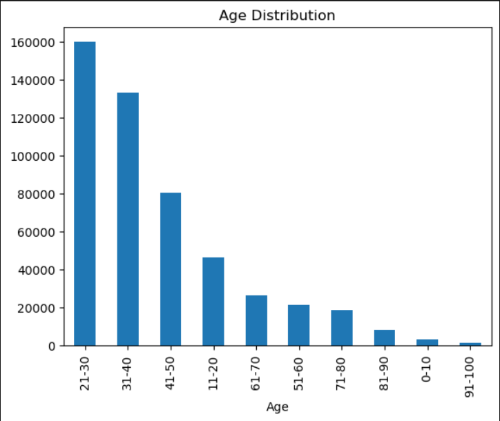
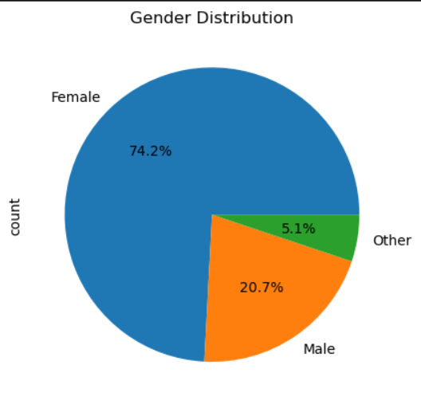
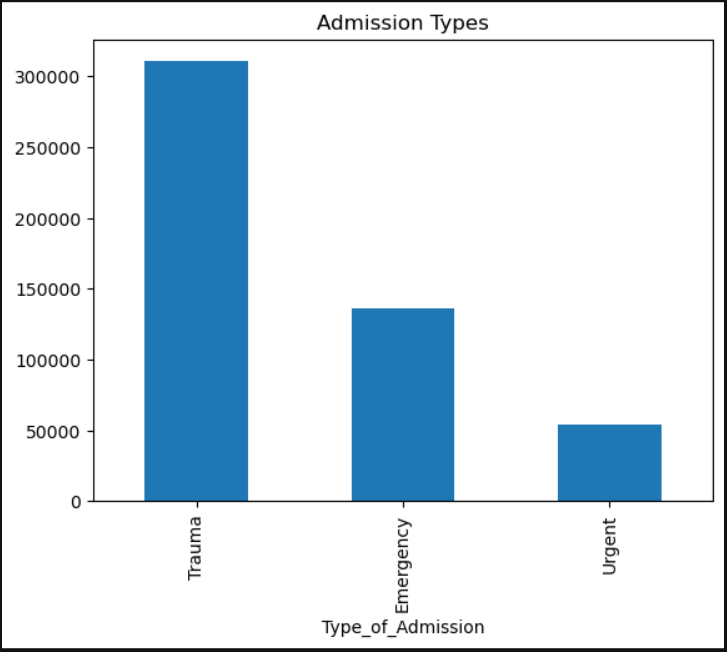
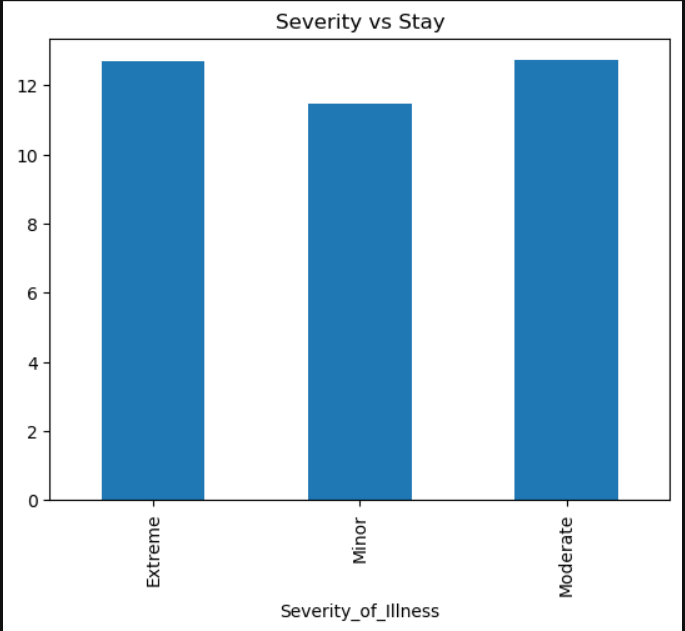

# 🏥 Hospital Patient Data Analysis & Severity Prediction using Machine Learning

## 📌 Overview
This project focuses on analyzing hospital patient data to uncover meaningful patterns in patient demographics, disease distribution, and hospital admission trends. It also includes a machine learning model to predict the severity of illness based on patient and hospital attributes.

---

## 🎯 Objectives
- Analyze patient demographics and disease patterns  
- Examine hospital admission trends and resource utilization  
- Evaluate treatment outcomes and healthcare efficiency  

---

## 📊 Exploratory Data Analysis (EDA)
The following analyses were performed:

- Age distribution of patients  
- Gender distribution  
- Department-wise patient distribution  
- Admission type analysis  
- Disease frequency  
- Severity vs hospital stay  
- Disease vs hospital stay  

👉 **Insight:**  
EDA helps us understand **what happened in the data 📊**

---

## 🤖 Machine Learning Model
- Model Used: **Random Forest Classifier**  
- Target Variable: **Severity of Illness**  
- Accuracy Achieved: **~75%**  

👉 The model learns patterns from historical data and predicts severity for new patients.

👉 **Insight:**  
Machine Learning helps predict **what will happen 🤖**

---

## 📁 Dataset Information
- Source: Hugging Face (healthcare_data)  
- Records: ~500,000 rows  
- Features include:
  - Age  
  - Gender  
  - Type of Admission  
  - Severity of Illness  
  - Health Conditions  
  - Hospital Stay Duration  
  - Insurance & Hospital Features  

---

## 📷 Sample Visualizations

### Age Distribution

### Gender Distribution

### Admission Types

### Severity vs Stay

---

## 📄 Research Paper
📌 Full IEEE-style research paper included:  
➡️ `research-paper/Final_Research_Paper.pdf`

---

## 🚀 Technologies Used
- Python 🐍  
- Pandas  
- Matplotlib  
- Seaborn  
- Scikit-learn  

---

## 💡 Key Insights
- Most patients belong to age group 21–30  
- Majority of patients are female (~74%)  
- Trauma is the most common admission type  
- Most hospital stays are between 7–10 days  
- Severity slightly affects hospital stay duration  

---

## 🏆 Project Highlights
✔ Large dataset (500k records)  
✔ Real-world healthcare analysis  
✔ Data visualization + insights  
✔ Machine learning prediction  
✔ IEEE research paper included  

---

## 📬 Future Scope
- Improve model accuracy using advanced ML algorithms  
- Add time-series analysis for hospital load prediction  
- Deploy model as a web application  

---

## ⭐ If you like this project
Give it a ⭐ on GitHub!
